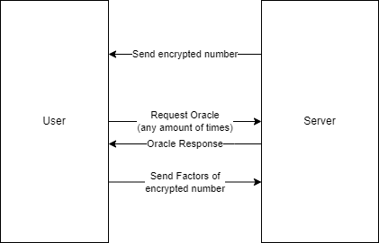

# KITCTFCTF 2022 - Prime Guesser 1 and 2
12.12.2022 by goreil

> Nicer formatting on https://saarsec.rocks/2022/12/12/KITCTFCTF-primeguesser.html

`Prime Guesser 1` and `Prime Guesser 2` are two cryptography challenges where a user guess the prime factors of an encrypted number. 
To help the user had acess to an oracle that tells whether a ciphertext is 0 or not. `Prime Guesser 1` had access to an extra Oracle but the exploit was basically the same. The encryption scheme seemed to be based on Polynomials. 

While the challenges look intimidating at the beginning, pulling out polynomial multiplication and addition, there has been a major oversight with the encryption scheme, allowing us to easily solve both challenges without really needing to understand what the encryption scheme actually does.
## Challenge overview

The Challenge server employed a custom polynomial based encryption protocol. The server will send you an encrypted number between 11 and 200 and the goal is to send back a set of prime-factors of the encrypted number. 

Between each encrypted number you can query an oracle any times you want that returns `True` or `False` whether a ciphertext corresponds to the plaintext 0. In `PrimeGuesser 1` you also have access to an oracle that will encrypt the number 1 - 20.

You need to send back the correct factors 100 times to get the flag.



### Example Encryption output

* Plaintext: 117 (not send to you)
* Ciphertext: (2 arrays of 64 numbers)

The interesting part of the challenge is the `encrypt` function. It just adds a scaled plaintext on top of an array of some random numbers. Using the oracle, we can easily recover the plaintext from any ciphertext. While the 165 lines can look very intimidating, only a few were actually relevant to solve the challenge.


Key differences in `PrimeGuesser 2` were:
* $n$, $q$ and $t$ were the same on the server as in the source
* The oracle didn't have `choice 0`


## Vulnerability

The `encrypt` function just added the plaintext on top of some random junk. If you add a decrement the `ciphertext[0][0]` with a certain $\text{delta}$ you the plaintext also decrements by one. Using the oracle this is enough to calculate the original plaintext.

```python
def encrypt(pk, size, q, t, poly_mod, pt):
    m = np.array([pt] + [0] * (size - 1), dtype=np.int64) % t
    delta = q // t
    scaled_m = delta * m  % q
    e1 = gen_normal_poly(size)
    e2 = gen_normal_poly(size)
    u = gen_binary_poly(size)
    ct0 = polyadd(
            polyadd(
                polymul(pk[0], u, q, poly_mod),
                e1, q, poly_mod),
            scaled_m, q, poly_mod
        )
    ct1 = polyadd(
            polymul(pk[1], u, q, poly_mod),
            e2, q, poly_mod
        )
    return (ct0, ct1)
```
While the challenge uses polynomial multiplication and polynomial addition, for us only polynomial addition is relevant, which just adds each element of one array to each element of the other array:
### Example:
* $a_1 = [1, 2, 3]$
* $a_2 = [5, 6, 7]$
* $a_1 + a_2 = [1+5, 2+6, 3+7] = [6, 8, 10]$

Knowing that $\text{size}, q, t, poly_mod$ are known global variables this is essentially: 

### function encrypt(pk, pt):
$\text{scaledplaintext} = [\frac{q}{t} \cdot pt, 0, 0, \dots, 0]$
generating magic arrays u, e1 and e2, which are not dependent on m
$ct_0 = pk_0 \cdot u + e + \text{scaledplaintext} $
using polynomial addition and multiplication
$ct_1 = (pk_1 \cdot u) + e $
$\text{return} (ct_0, ct_1)$

where
* $pk$ is the private key 
* $pt$ is the plaintext
* $ct$ is the ciphertext, consiting of two arrays $ct_0$ and $ct_1$

Since $\text{scaledplaintext}$ only gets added at the end and mostly consists of zeros, we can easily modify a ciphertext to return a different value:

### Example
We get the following ciphertext:

$c_0 = 39580,1032718, \dots$ \
$c_1 = 471397,629045, \dots$ 

which corresponds to $pt = 117$


If we modify only the first number of $c_0$ like this:

* $c_0 = 39580 - (\frac{q}{t}),1032718, \dots$
* $c_1 = 471397,629045, \dots$ 

We reduced the $pt$ by one. This is also something we can repeat infinitely. To solve the challenge we then only need to substract 1 for the plaintext each time, until the oracle returns true. The code might look like this:

```python
step = np.array([q / t] + [0] * 63)
for i in range(11, 201): # the random number is between 11 and 201
    new_ct = ct[0] - i * step, ct[1]
    if oracle(new_ct): # plaintext of new_ct is 0
        print("The plaintext is", i)
        break
```

### Getting q and t
Interestingly with our approach `Prime Guesser 2` is already solved, since $q$ and $t$ known. 

To get $q$ and $t$ in `Prime Guesser 1` we follwed the *Guesser* part and just eyeballed the values:

1. We just assume that $q$ and $t$ are powers of 2 since they are in the local challenge script.
2. We can guess $q$ with the first ciphertext, since it is probably the next power of 2 that is bigger than all values in the ciphertext.
3. We use the *encrypt oracle* to encrypt the number 1. We then iterate through possible stepsizes until we get a correct one with which the plaintext is 0.

**Result:** $\frac{q}{t} = 0\text{x}100000$


## Exploit
Our exploits follows the vulnerability description. Since we need to find 100 numbers and each number is randomly split between 11 and 200, we should need approx. $ 100 \cdot \frac{201 - 11}{2} = 9500$ requests to the oracle. In practice this meant that the exploit takes around 10 minutes to run.

```python
#!/bin/env python3
from pwn import *
import json
import numpy as np
import sys

# Command line arguments to make it work on both Challenges
argv = sys.argv
if len(argv) != 3 or argv[1] not in ["LOCAL", "REMOTE"] or argv[2] not in ["1", "2"]:
    print("Usage: {argv[0]} [LOCAL|REMOTE] [1|2]" )

LOCAL = argv[1].lower() == "local"
chall_nr = argv[2]

delta = 0x400
if chall_nr == "1" and not LOCAL:
    delta = 0x100000

if LOCAL:
    r = process(["python3", f"PrimeGuesser{chall_nr}.py"])
else:
    if chall_nr == "1":
        r = remote("kitctf.me", 4646)
    else:
        r = remote("kitctf.me", 4747)

option_oracle = b'1' if chall_nr == '1' else b'0' # They changed the option number for the oracle
option_guess = b'2' if chall_nr == '1' else b'1' # They changed the option number for the oracle

# Factorization function since we send the factors, not the real number
def get_factors(number):
    """Same function as PrimeGuesser1.py"""
    factors = set()
    for i in [2, 3, 5, 7, 11, 13, 15, 17, 19, 23]:
        if i >= number:
            break
        if (number % i == 0):
            factors.add(i)
            other = number // i
            prime_set = get_factors(other)
            if len(prime_set) == 0:
                factors.add(other)
            else:
                for num in prime_set:
                    factors.add(num)
            
    return factors

factors = {i:get_factors(i) for i in range(11, 201)}

# Helper functions to interact with the challenge
def get_ct():
    """Returns the ciphtertext after a request"""
    return tuple(np.array(json.loads(b"[" + r.readline() + b"]")) for _ in range(2))

def send_ct(ct):
    """Sends a ciphtertext to the session"""
    r.writeline(b",".join([str(x).encode() for x in ct[0]]))
    r.writeline(b",".join([str(x).encode() for x in ct[1]]))
    
def request_oracle(ct, number):
    """Request the decryption oracle"""
    test = (ct[0] - np.array([number] + [0] * (len(ct[0]) - 1)), ct[1])
    r.writeline(option_oracle) # Request oracle
    send_ct(test)
    [r.readline() for _ in range(3)]
    return r.readline() == b'True\n'


# Final exploit
for i in range(100):
    ct = get_ct()
    # Request oracle until number is found
    for guess in range(11, 201):
        print(guess, end = "\r")
        if request_oracle(ct, guess * delta):
            info(f"({i+1}/100) Number = {guess} = {factors[guess]}")
            break

    else:
        raise Exception("guess not found")

    # Send the factors
    r.writeline(option_guess)
    r.writeline(b','.join([str(i).encode() for i in factors[guess]]))
    r.readline()
    r.readline()


print("Finished")
r.interactive() # Prints the flag
```

## Summary
This writeup showcases how you don't have to understand a whole encryption scheme to exploit it. We are able to modify corresponding plaintext to a ciphertext to decrement it in steps of one. With the Oracle that told us whether a ciphertext corresponst to zero, the exploitation was quite easy.


