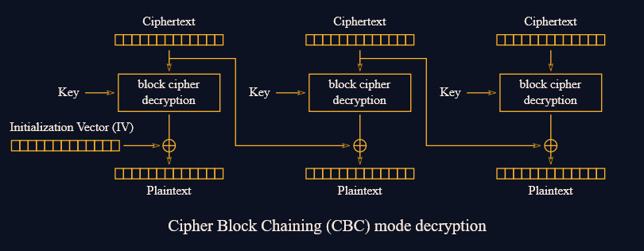
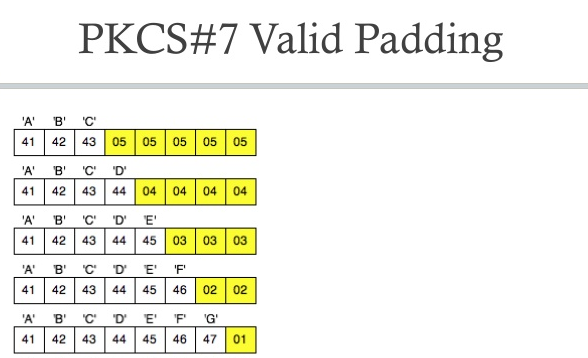
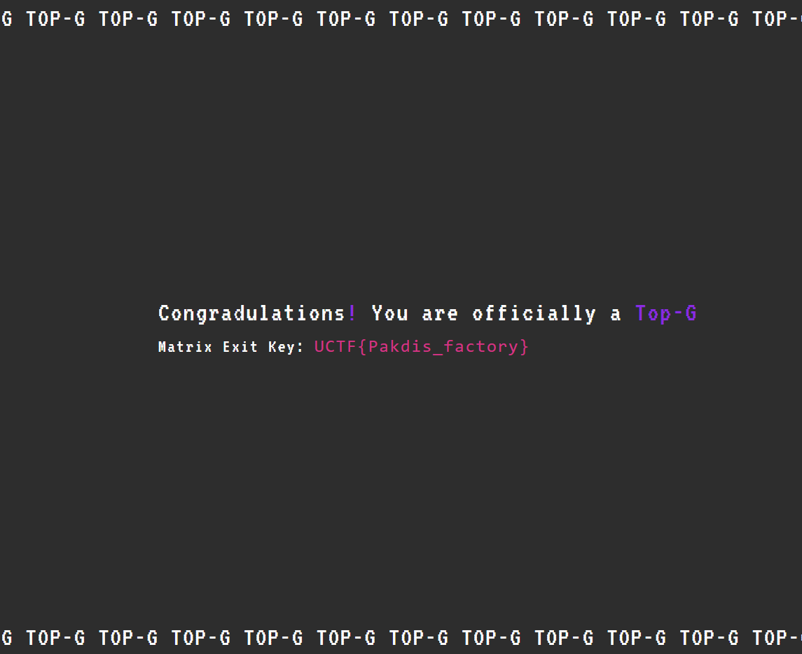

# Padding Oracle Writup

> Greetings, brave challengers! As you embark on the Padding Oracle Adventure, remember that the key to triumph lies in understanding the AES-128-CBC encryption's Achilles' heel—the vulnerable Cipher Block Chaining mode. May the flags be with you!
>
> https://matrix.uctf.ir/
>
> hint 1: login page grants access to a user with the credentials "guest" for both the username and password. hint 2: token structure: {"user": ""}


# Quick summary
The cookie `token` will be decrypted by the server and is used to check the current user. 
The goal is to log in as the user "topg" and we are currently "guest". 
The server will return `error:1C800064:Provider routines::bad decrypt` if the padding is invalid. 
This gives us a padding oracle attack.
A padding oracle attack lets us decrypt the cookie by bruteforcing bytes one by one and checking if the padding is valid.
If we know the plaintext of the cookie, we can change it to anything we want, since AES-CBC is malleable.

# Background
## AES-CBC


AES-CBC is a block cipher mode of operation.
It encrypts blocks of 16 bytes at a time.
A property we can abuse is the fact that by xor'ing the ith byte of the ciphertext, the plaintext of the ith+16 byte block will be changed.

## PKCS#7 Padding



PKCS#7 padding is a padding scheme used to pad messages to a multiple of the block size.
For example, if we are missing 3 bytes to fill the block, we will add 3 bytes with the value 0x03.
If we are missing 2 bytes, we will add 2 bytes with the value 0x02.
To prevent ambiguity, we will always add padding: if the message is a multiple of the block size, we will add a full block of padding (16 bytes).

# Padding Oracle Attack
## Helper Function
This helper function will make a request to the server with the given token.

```python
import requests
import base64
from pwn import xor

orig_token = b'\x8f+\x8a\x18\x15U\x8a\xaf0\xbc\x19\x8d+\x9e\x82\xca\xfe\xd3%\xc8\xdc\xa3\xfa\r\x85\x03\xe3\xf8"G-]\x9aJ\xecN\x1c\xfc\xf5~\xa2\xba\x84\xf4cz\x9f\x15'
orig_token = bytearray(orig_token)

def get(token):
    """Make a request with the token"""
    burp0_url = "https://matrix.uctf.ir:443/profile"
    enc_token = base64.b64encode(token).decode()
    burp0_cookies = {"a07680ed6e93df92c495eaba7ddfe23b": "5a03b1cd582744aec25f4bb1503a701a", "token": enc_token}
    burp0_headers = {"Cache-Control": "max-age=0", "Upgrade-Insecure-Requests": "1", "User-Agent": "Mozilla/5.0 (Windows NT 10.0; Win64; x64) AppleWebKit/537.36 (KHTML, like Gecko) Chrome/115.0.5790.171 Safari/537.36", "Accept": "text/html,application/xhtml+xml,application/xml;q=0.9,image/avif,image/webp,image/apng,*/*;q=0.8,application/signed-exchange;v=b3;q=0.7", "Sec-Fetch-Site": "same-origin", "Sec-Fetch-Mode": "navigate", "Sec-Fetch-User": "?1", "Sec-Fetch-Dest": "document", "Sec-Ch-Ua": "", "Sec-Ch-Ua-Mobile": "?0", "Sec-Ch-Ua-Platform": "\"\"", "Referer": "https://matrix.uctf.ir/login", "Accept-Encoding": "gzip, deflate", "Accept-Language": "en-US,en;q=0.9"}
    return requests.get(burp0_url, headers=burp0_headers, cookies=burp0_cookies)

def oracle(token):
    """Padding oracle"""
    resp = get(token)
    return resp.content !=  b'error:1C800064:Provider routines::bad decrypt'
```

## Step 1: Get the padding length

We know that the last bytes of the plaintext are the padding bytes.
A quick test confirms that the padding is 16 bytes long.

```python
In [9]: oracle(original_token[:16] + xor(16, 15, original_token[16:32]) + original_token[32:])
Out[9]: True

In [10]: oracle(original_token[:16] + xor(16, 17, original_token[16:32]) + original_token[32:])
Out[10]: False
```

### Step 2: Get the plaintext, starting with the last byte
To get the last byte of the plaintext, we bruteforce it with the following idea:
`oracle(xor(ct[16], guess, '\x01'))` will return true if the padding is valid, and false otherwise.
If we get the correct plaintext, we can continue with the next byte.

```python
orig_token = original_token[:-16] # Remove last block of padding (it's the 16 byte padding)

for i in range(1, 16):
    target_padding = (bytes([i]) * i).rjust(16, b'\x00')
    print(f"Target padding: {target_padding}")

    # Since we have json, we can only use printable characters and we start with common values first
    for test in "{}\",:'" + string.ascii_lowercase + string.ascii_uppercase + string.digits + string.punctuation:
        token = bytearray(orig_token)
        padded_data = data.encode().rjust(16, b'\x00')
        token = bytearray(xor(token[:16], target_padding, padded_data)) + token[16:]
        print(f"{test=} {hex(ord(test))}")
        token[16-i] ^= ord(test)
        print(f"{xor(token, orig_token).hex()=}")
        if oracle(token):
            print(f"Found byte {i}: {test}")
            data = test + data
            print(f"Data: {data}")
            break
    
    else:
        raise ValueError("Failed to find byte")
```

### Step 3: Forge a new token
Since we are impatient we stop the script at: `Data: ":"guest"}`.
We know that if we change that to `:"topg"}\1`, we will be logged in as "topg". 
We need to add the `\1` for the correct padding.

```python
token = xor(orig_token[:-16], b'guest"}'.rjust(16, b'\x00'), b'topg"}\1'.rjust(16, b'\x00')) + orig_token[-16:]
# Get the flag
print(get(token).content)

# Get the token in case you want to log in with your browser
print(f"Token: {base64.b64encode(token).decode()}")
```



