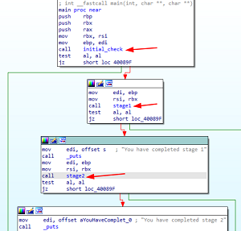
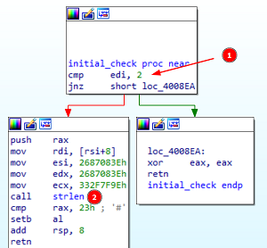
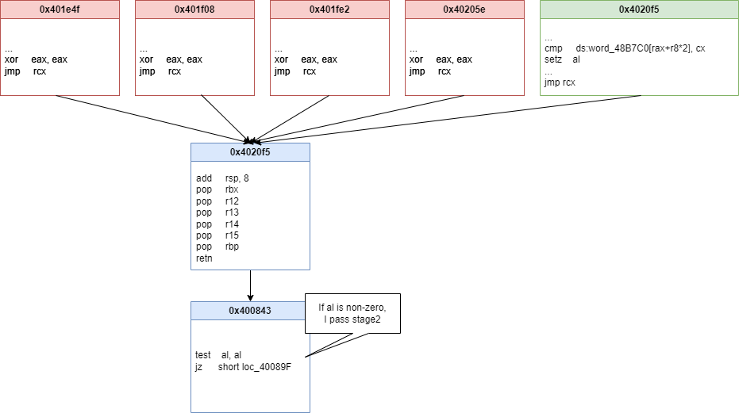

# Hurdles Part 1
> CSCG is in may ways like hurdling. Our challenge attempts to hide the obstacles in a way you might not be used to. Can you solve the first two stages?
> 
> Note: The flag(s) will start with a lowercase cscg{. Please uppercase the start characters.

The challenge is a 64-bit stripped binary. Running it will yield `Bad input`. 
Challenges like these normally require the user to provide the correct input and will then output the flag.

For this challenge I used `IDA-Free` to do an initial analysis and then `angr` and bash scripting for retrieving the flag.

# Initial analysis


Looking at the main function, I can see that I need to pass 3 checks, to solve the "first two stages" as mentioned in the challenge description.

## initial_check


Looking at the initial check I make an educated guess that it checks for `argc` and `argv`, since it didn't prompt me for any input
when I ran the binary normally. Looking at the values `2` and `0x23` I guess that it means:
1. `argc` must be 2, meaning I only provide one argument, probably some sort of password
2. the length of the password must be `<= 0x23`

## Symbolic execution
Whenever I reach a checkpoint, the challenge will print out `You have completed stage X`, where X is the stage I completed. 
Symbolic execution is perfect for these sort of challenges, since I can ask "Give me the password that allows me to reach stage 2"
and hopefully it gives me the correct output.

I'm using this code that uses the library `angr` to reach the outputs "stage1" and "stage2":
```python
import angr, claripy
import logging

logging.getLogger("angr").setLevel("INFO")
proj = angr.Project("./hurdles", auto_load_libs=False)

# Initial check: Password has max length 0x22
password = claripy.BVS( "password", 0x22 * 8)

state = proj.factory.entry_state(
    args=["./hurdles", password],
    # These options are needed to stop angr from screaming
    add_options=  { "ZERO_FILL_UNCONSTRAINED_MEMORY", "ZERO_FILL_UNCONSTRAINED_REGISTERS" }
)
# Veritesting helps trim down states
simgr = proj.factory.simgr(state, veritesting=True)

def instate(out):
    return lambda s: out in s.posix.dumps(1)

### STAGE 1 ###
simgr.explore(find=instate(b"stage 1"), avoid=instate(b"Bad"))
stage1 = simgr.found[0]

### STAGE 2 ###
simgr = proj.factory.simgr(stage1, veritesting=True)
simgr.explore(find=instate(b"stage 2"), avoid=instate(b"Bad"))

## Print results
print("Stage 1:, ", stage1.solver.eval(password, cast_to=bytes))
if simgr.found:
    print("Stage 2:, ", simgr.found[0].eval(password, cast_to=bytes))
else:
    print("Stage 2 not found")
```

This code solves Stage 1 and I get 
`Stage 1:,  b'1_kn0w_h0w_\x01\x01\x01\x04\x10\x01\x01\x01\x01\x01\x01\x01\x01\x04\x01\x01\x01\x01\x01\x01\x00\x00\x00'`
Unfortunately, I don't get Stage 2.

## Understanding Stage 2
For Stage 2, my Simulation manager `simgr` returns 5 states marked as `avoid`, meaning all of them reached Stage1 and then failed.
A different state normally means that the program took a different execution path. By analysing the paths I can get insights.
My initial strategy is to look backwards, I can find that the sixth from last block differs.
```python
In [9]: [list(s.history.bbl_addrs)[-6:] for s in simgr.avoid]
Out[9]:
[[0x401e4f, 0x4020f5, 0x400843, 0x40089f, 0x400650, 0x700010],
 [0x401f08, 0x4020f5, 0x400843, 0x40089f, 0x400650, 0x700010],
 [0x401fe2, 0x4020f5, 0x400843, 0x40089f, 0x400650, 0x700010],
 [0x40205e, 0x4020f5, 0x400843, 0x40089f, 0x400650, 0x700010],
 [0x401cf3, 0x4020f5, 0x400843, 0x40089f, 0x400650, 0x700010]]
```



Analysing the code, I can see that only the last state is able to reach stage 2, since all other states set `al` to zero via `xor eax, eax`.

## Bruteforce stage 2
```python
In [19]: simgr.avoid[-1].solver.eval(password, cast_to=bytes)
Out[19]: b'1_kn0w_h0w_7020\x04\x01\x02\x08\x02\x08\x01\x02\x02\x02\x04\x08 \x04\x01\x08\x04\x80\x08'
```
Stage 2 added "7020" to the stage 1 password. 

Since there were 4 fail-states, I can assume that each checked for one of the 4 characters. 
An educated guess would be that all of those 4 characters need to be digits. Since 4 digits are just 10000 possibilities, I can just bruteforce the solution.

```bash
(for i in $(seq -f "%04g" 0 9999); do echo $i; ./hurdles "1_kn0w_h0w_$i"; done) | tee log.txt
0000
You have completed stage 1
Bad input
0001
...
```
This code just attempts all digits. Using the search function of my editor, I can find the correct password:
```
...
2448
You have completed stage 1
You have completed stage 2
You have made it to the interim flag: cscg{y4y_1_50lv3d_7h3_f1r57_h4lf}
...
```

# Solution
The flag is `CSCG{y4y_1_50lv3d_7h3_f1r57_h4lf}`, since the challenge description says I need to turn cscg into uppercase.